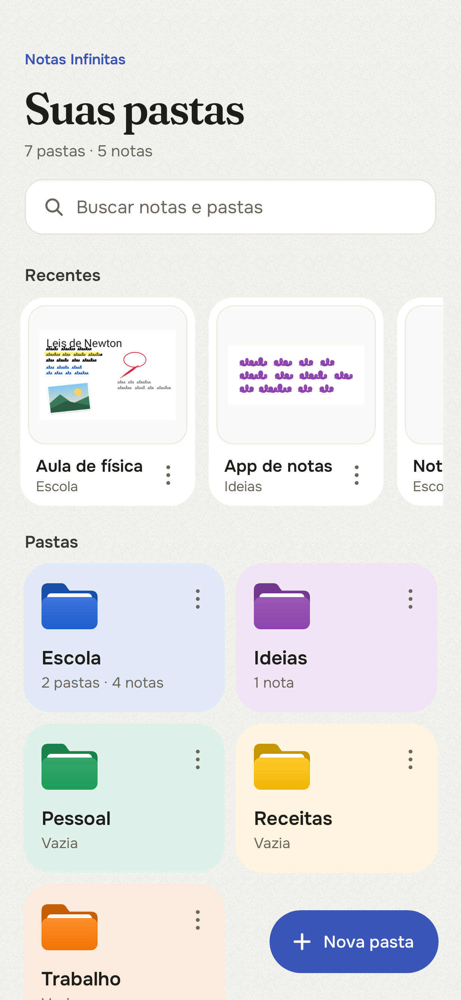
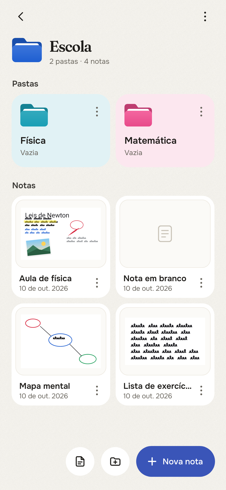
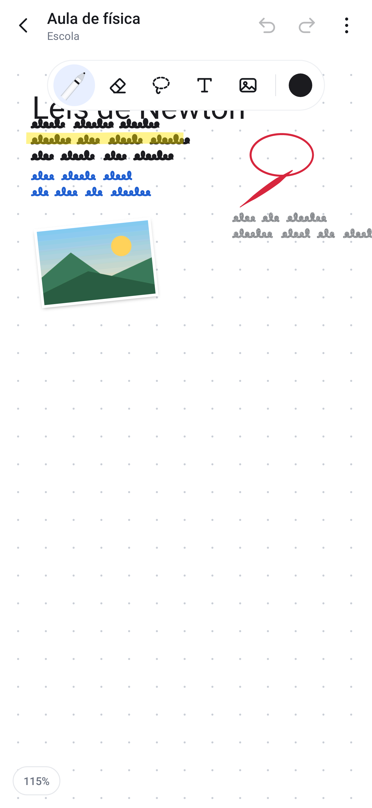
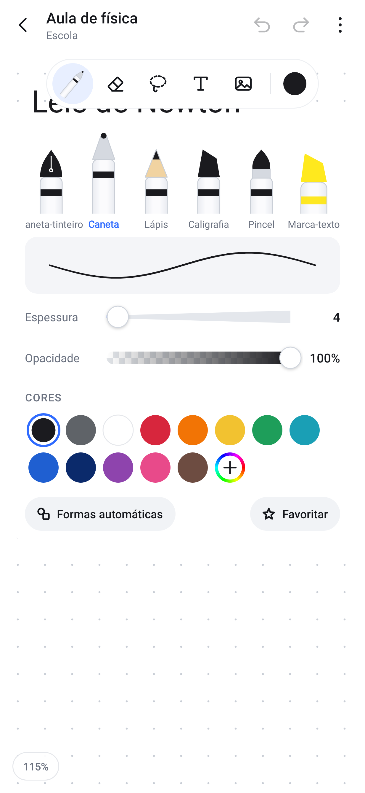

# Notas Infinitas

App Android (Kotlin) de anotações à mão com **tela infinita na horizontal e na vertical**,
pensado para a S Pen dos Galaxy.

<p>
  
  
  
  
</p>

As capturas em `docs/screenshots` são geradas pelo CI (Robolectric) a cada mudança.

## Como usar

### Pastas (página inicial)
- **Busca** de notas e pastas (ignora acentos).
- O app abre na tela de **Pastas**. Toque em **+** para criar uma pasta (nome e cor).
- Dentro de uma pasta, o **+** cria uma **nota** ou uma **subpasta**.
- Segure uma pasta ou nota para **renomear, mudar a cor, mover, duplicar ou excluir**.
- As notas aparecem com miniatura e data da última alteração.

### Editor
- **S Pen** escreve; segurando o **botão lateral**, apaga (dá para desligar).
- **1 dedo** move a tela em qualquer direção; **2 dedos** dão zoom (5% a 800%).
- Menu ⋮ → **Dedo: escreve** faz o dedo também escrever (aí 2 dedos movem).

### Canetas (toque de novo na caneta, ou na bolinha de cor, para abrir a bandeja)
- **Caneta-tinteiro**, **Caneta**, **Lápis** (com textura), **Caligrafia** (bico chato
  inclinado), **Pincel** (pressão forte e pontas afinadas) e **Marca-texto** (translúcido).
- Cada pincel lembra sua **espessura**, **opacidade** e **cor**.
- Paleta de cores + **cor personalizada** (espectro, matiz e código hex); as cores
  personalizadas ficam salvas.
- **Formas automáticas**: linha reta, círculo/elipse, triângulo, retângulo, pentágono.
- **Favoritos**: salve combinações de caneta e use pela barra (segure para remover).

### Caneta com latência mínima
- A tinta em andamento é desenhada direto no buffer da tela (front buffer), sem
  esperar o próximo quadro, e a nota não é redesenhada a cada ponto.
- Em Android 14+, previsão de movimento quando o front buffer não está disponível.
- O editor pede a taxa de atualização máxima da tela (ex.: 120 Hz).
- Pode ser desligada no menu ⋮ ("Tinta de latência mínima").

### Texto (como no Samsung Notes)
- Toque com a ferramenta **T** e digite direto na tela. A barra acima do teclado tem
  fonte, tamanho, **negrito**, *itálico*, sublinhado, tachado, alinhamento, cor e
  marca-texto. Com um trecho selecionado, o estilo vale só para o trecho.
- Toque de novo num texto selecionado para editar. Com a seleção: girar (alça ou 90°),
  aumentar/diminuir, espelhar, virar, endireitar, cor, frente/trás, duplicar e excluir.

### Imagens e PDF
- Toque na imagem com a seleção: girar livre (com ímã nos ângulos retos), recortar
  (livre, 1:1, 16:9, círculo, à mão livre), ajustes (filtros, brilho, contraste,
  saturação, opacidade), cantos, moldura, sombra, espelhar, travar, substituir,
  salvar na galeria.
- PDF: importa todas as páginas em coluna, lado a lado ou em grade, travadas como
  fundo. Destrave uma página para mover, girar, recortar ou separar.

### Outras ferramentas
- **Borracha** (toque de novo para opções): apagar traço inteiro ou **por área**,
  tamanho, **só marca-texto**, apagar tudo.
- **Seleção (laço)**: circule o que quiser e **mova**, **redimensione** (bolinha no canto),
  **duplique**, **mude a cor** ou **exclua**.
- **Texto**: toque na tela para digitar; toque num texto existente para editar.
- **Imagem**: insere uma foto da galeria (já vem selecionada para posicionar).
- **Plano de fundo**: em branco, pontilhado, pautado ou quadriculado, e cor do papel.
- **Desfazer / Refazer**, **Exportar PNG** (Imagens/NotasInfinitas) e
  **Exportar PDF** (Downloads/NotasInfinitas).
- Tudo é salvo automaticamente ao sair da nota.

## Como instalar
O APK é gerado pelo GitHub Actions (workflow `Notas Infinitas (APK Android)`):
abra a execução mais recente na aba **Actions**, baixe o artefato `notas-infinitas-apk`,
descompacte e instale o `.apk` no celular (permita "instalar apps desconhecidos").

O APK é assinado com uma chave de debug fixa (`app/debug.keystore`), então as versões
novas instalam por cima das antigas sem perder as notas.

## Compilar localmente
Requer JDK 17 e Android SDK (Android Studio):

```
cd notas-infinitas
./gradlew assembleDebug
```

## Próximos passos
- Reconhecimento de escrita à mão (converter para texto)
- Busca nas notas
- Gravação de voz junto com a nota
- Importar PDF para anotar por cima
